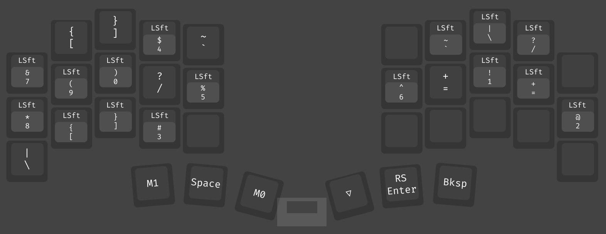
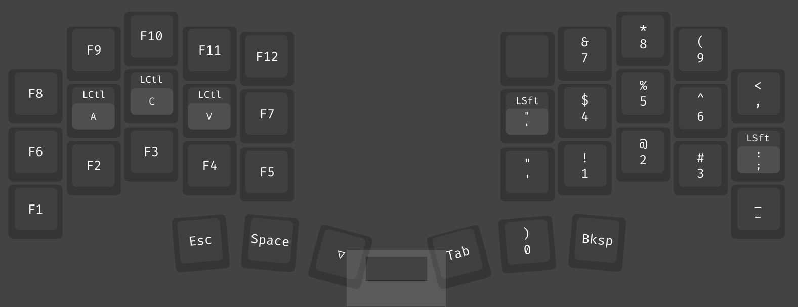
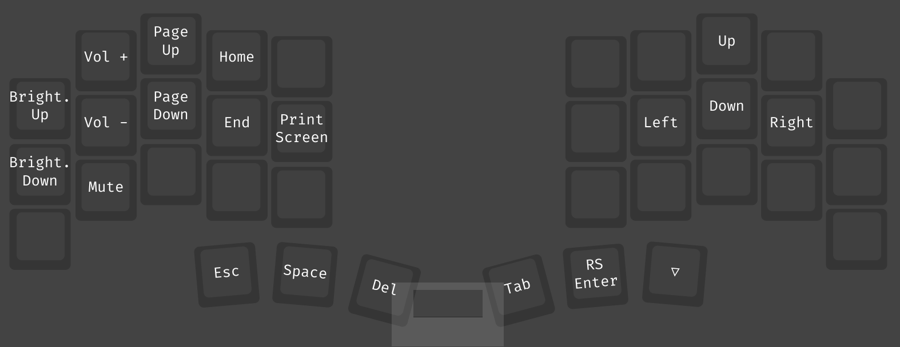

# Piantor Pro BT ZMK Configuration

This repository contains my ZMK configuration for a [Piantor Pro BT from
Keebart](https://www.keebart.com/products/piantor-wireless).

I own a regular wired 5x6 Piantor Pro for at home configured via QMK, and a bluetooth one for on the
go configured based on this configuration. Both configurations are identical except for the couple
notes below.

Moreover I emulate this layout using [kanata](https://github.com/jtroo/kanata) on my laptops. The
configurations for this can be found in my [Nix setup
repository](https://github.com/f4z3r/nix/blob/master/nixos/kanata.nix). In that setup I have
additional macros for QoL. I rarely use them though.

## Configuration

Most of the configuration is done via [Keymap Editor](https://nickcoutsos.github.io/keymap-editor/)
with some setting tweaks done by hand.

## Layout

### COLEMAK

This is technically a Colemak Mod-DH layout.

> [!NOTE]
> The grave escape is modified to print an underscore (`_`) when right-shifted. Additionally, on the
> BT version, the "homerow mods" will only trigger on keys of the other hand.

### SYMBOLS

> [!NOTE]
> The `M0` macro prints a double quote with a space (to have a full double quote sequence on US intl
> layouts), and the `M1` macro prints a single quote with a space.

### NUMBERS

### MOVEMENT

> [!NOTE]
> On the BT version, the right most three keys serve to define the bluetooth profile. Specifically,
> from top to bottom:
> - Clear bluetooth profile
> - Next bluetooth profile
> - Previous bluetooth profile

## Settings

Generally, the tapping for tap/hold, mod/tap, or tap/layer is setup to have a tapping term at 150ms
and a quick tap term of 150ms. I use:

- `balanced` tap behaviour with `hold-trigger-on-release` on tap/hold for the homerow mods
- `hold-preferred` tap behaviour with `hold-trigger-on-release` on mod/tap for shifted enter
- `tap-preferred` tap behaviour on tap/layer.

This configuration perfectly matches my typing style for homerow mods and how I use my mod/tap
"Enter RS" key on the right thumb. It allows for the typical rolling movements of the Colemak layout
while easily allowing to combine mods on one hand with a keys press of the other hand.
